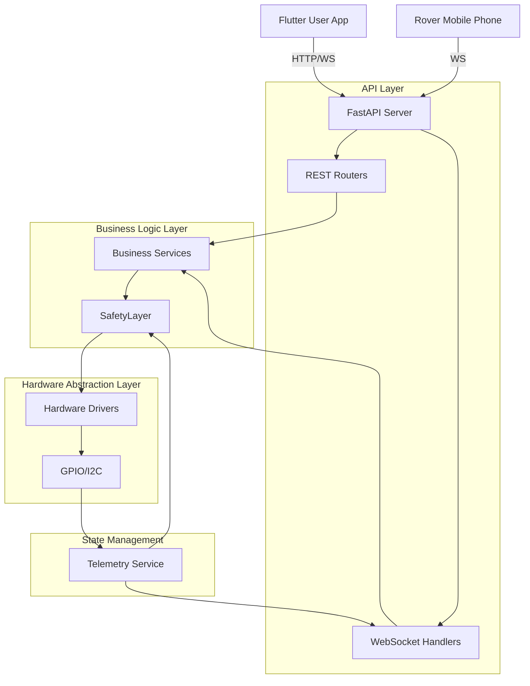

# SENTRA Backend Architecture

## Overview
SENTRA is an autonomous elderly-assistance robot backend designed for Raspberry Pi 5. It follows a layered architecture to ensure safety, modularity, and scalability.

### High-Level Architecture Diagram

## Layered Responsibilities

### 1. API Layer (FastAPI)
- **REST Endpoints**: Handle configuration, authentication, pairing, and high-level commands (e.g., "Go to Kitchen").
- **WebSocket Handlers**: Provide real-time bidirectional communication for:
    - **Telemetry**: 10Hz system state broadcasts.
    - **Control**: Low-latency movement commands.
    - **Alerts**: Instant push notifications for safety events.
    - **Call**: Signaling for video/voice calls.

### 2. Business Logic Layer (Services)
- **Navigation/Patrol/Docking**: High-level FSMs that translate location goals into motion requests.
- **Vision Pipeline**: Processes frames from the Rover phone to perform AprilTag localization, person detection, and fall detection.
- **SafetyLayer (`core/safety.py`)**: The critical "gatekeeper." Every motor command must pass through this layer. It enforces:
    - Emergency Stops (E-Stop).
    - Obstacle avoidance (Ultrasonic/Cliff sensors).
    - Mode arbitration (Manual vs. Autonomous).
    - Command timeouts (Watchdog).

### 3. Hardware Abstraction Layer (Drivers)
- **Motor Service**: Manages L298N differential drive with acceleration ramping.
- **Sensor Services**: Handles non-blocking polling of HC-SR04 ultrasonic sensors, MPU6050 IMU, and IR cliff sensors.
- **Communication**: Uses `lgpio` for Pi 5 GPIO and `smbus2` for I2C.

## Data Flow
1. **Control Flow**: `User App` $\rightarrow$ `Control Router` $\rightarrow$ `Motion Controller` $\rightarrow$ `SafetyLayer` $\rightarrow$ `Motor Driver` $\rightarrow$ `GPIO`.
2. **Telemetry Flow**: `GPIO/I2C` $\rightarrow$ `Sensor Services` $\rightarrow$ `Telemetry State` $\rightarrow$ `Telemetry WS` $\rightarrow$ `User App`.
3. **Vision Flow**: `Rover Phone` $\rightarrow$ `Vision Service` $\rightarrow$ `AprilTag/Person Service` $\rightarrow$ `Navigation/Alerts`.

## Implementation Status (Phase Audit)

| Phase | Feature | Status | Notes |
| :--- | :--- | :--- | :--- |
| 1-3 | Core State & Safety | ✅ | Implemented in `core/state.py`, `core/safety.py` |
| 4 | Unified Sensors | ✅ | `services/sensor_service.py` |
| 5-6 | Localization & Mapping | ✅ | AprilTag and Manual Mapping services active |
| 7-8 | Patrol & Docking | ✅ | P-control docking and waypoint patrol implemented |
| 9 | Voice Commands | ✅ | `services/voice_service.py` |
| 10-12 | Person & Fall Detection | ✅ | temporal evidence based fall detection active |
| 13-14 | Emergency & Notifications | ✅ | Auto-call and persistent notification feed active |
| 15-16 | Auth & Cloud Relay | ✅ | JWT role-based access and remote relay implemented |
| 17-21 | System Hardening & Compat | ✅ | Simulation mode and app compatibility layers active |
| 22-25 | Hardware Validation | ⚠️ | Logic complete; awaiting physical Pi 5 verification |

## Technical Debt & Risks
- **Blocking Async Paths**: MJPEG streaming uses blocking locks, potentially starving the event loop.
- **Camera Resource Conflict**: `capture_snapshot` re-initializes the camera, conflicting with active streams.
- **CPU Usage**: Ultrasonic polling uses busy-wait, increasing CPU load.
- **Hardware Safety**: Lack of a physical hardware watchdog (software-only currently).
